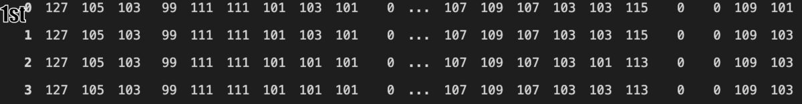

# Intrusion Detection System
This project can **identify network attacts** with the help of packet data flow patterns on the network. Currently it is a binary **Classification Supervised learning** project that'll deal with detecting only DoS attacks, but I'll be more than happy to expand this project to larger domain scale than current if time permits.

## Problem Statement
**Intrusion Detection Systems** (IDSs) and **Intrusion Prevention Systems** (IPSs) are the most important **defense tools** against the sophisticated and ever-growing network attacks. Given a **Network flow data**, can we detect different network attacks?

### About Data
There are different types of network attacks such as Brute Force FTP, Brute Force SSH, DoS, Heartbleed, Web Attack, Infiltration, Botnet and DDoS. But, in this data set we have only provided **DoS attack**.
- Data is in **csv** format, training samples: 519519 , features: 79
- It is an **Imbalanced Dataset**, around 60:40 ratio.

### Data Analysis Insights with understanding
- Data has **missing values** as well as **infinity values**, that represents a DoS attack.
- There are 74 **Contineous Features**, 4 **Nominal Categorial Features**(flags) and target(Label).
   
#### Techniques 
- **SMOTE** for Data Sampling.
- **Feature Selection** using sklean.feature_selection.mutual_info_classif() of 30 features from 79 features with little to no variation in evaluation metric and then using **Corelation Matrix** to reduce to 19 features removing **Multicolinearity**.

### Different Approaches Used
- [ ] Approach 1: XGBoost     

[Approach 1](Notebooks/anamoly-detection.ipynb) | [Approach 2](Notebooks/anamoly-detection-using-image.ipynb)

## Output
|ID | Classification|
|---|---------------|
|0	|0 |	BENIGN|
|1	|1 |	DoS|
|2	|2 |	BENIGN|
|3	|3 |	DoS|
|4	|4 |	DoS|
|. |. |...|
|. |. |...|
|. |. |...|

=======

## Conclusion
We can detect different Network Attacks using patterns in Data Packet Flows in Network.

### Business Understanding
**DOS**: Flooding the targeted machine or resource with superfluous requests in an attempt to overload systems and prevent some or all legitimate requests from being fulfilled.
**Some Techniques**:
- Holds the connection open by sending valid, incomplete HTTP requests to the server at regular intervals to keep the sockets from closing.
- By repeatedly sending initial connection request (SYN) packets(Getting ACK packet from server and not sending back 3rd handshake ACK packet while the server waits at that port forever), the attacker is able to overwhelm all available ports on a targeted server machine. [Read More Here](https://www.cloudflare.com/learning/ddos/syn-flood-ddos-attack/)
- a time delay between successive attacking packets.
- HTTP slow POST DoS attack: sends large content length header and sends content very slow speed.- the attacker sends traffic consisting of complicated requests to the system.

- Each "Pig"(here) has 84 sensors in circumference that captures data every millisecond while travelling in pipes. So this becomes a `time series problem` where each traversal time for each independent pipe is 5_000 milliseconds.

###### Tribute @my Mentor Hasan Ali
